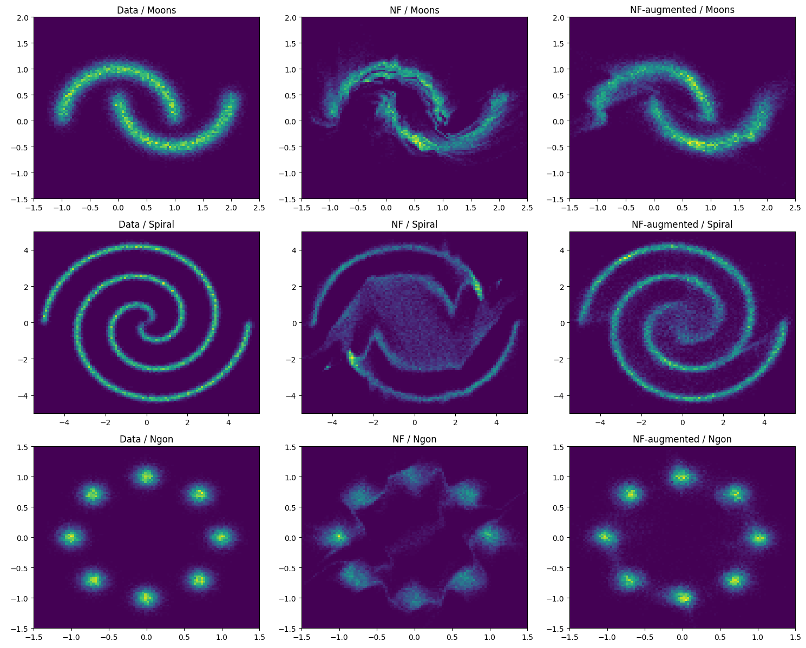

# SurVAE

A repliaction of "SurVAE Flows: Surjections to Bridge the Gap between VAEs and Flows", implemented as the final project for the "Generative Neural Networks" class of the University of Heidelberg, 2024.




## Structure

The repository contains the following:

```
.
├── assets     # relevant PDFs
├── notebooks  # Jupyter notebooks
├── saves      # save states for MNIST
└── survae     # source code
```


## Tests

To run all of the tests, use the following command:

```
python3 -m survae.test
```
